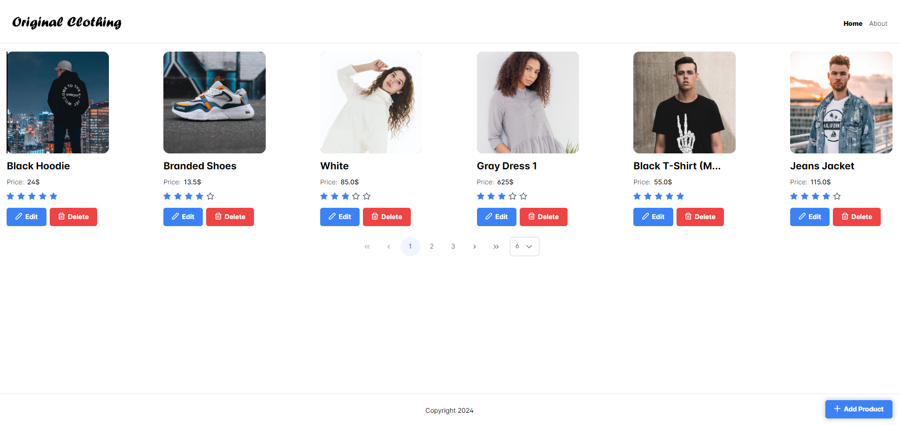
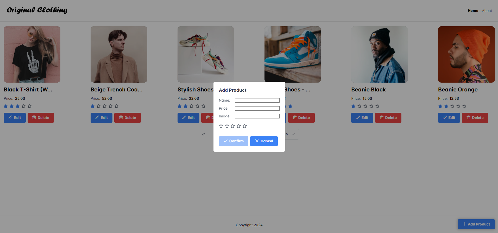

# Storefront Full Stack Project: Angular & Node.js + Express

This project was mainly created to **Angular**.

## Overview

- **Backend**: Node.js + Express
- **Frontend**: Angular 18
- **API Testing**: Postman

## Images

